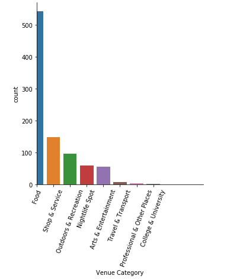

Silicon valley is the global centre for tech innovation and a home to many major software and internet companies. Office areas provide a huge opportunity for food trucks, especially during brunch hours. We'll go thorugh the major cities included in silicon valley and try to decide which ones are suitable to open a sandwich cart considering serveral factors like cost,maintenance, audience availability etc.

# Tools used:
- For data processing: Python ML ecosystem (Numpy, Pandas, Sklearn)
- For visualization: wordcloud, Matplotlib, Seaborn
- Others:
  - [folium](https://pypi.org/project/folium/) : For locations visualization
  - [geopy](https://pypi.org/project/geopy/) : For geocoding
  
# Results:
1. Number of venues per category:

2. Food joint clusters:

# Conclusion:
San Jose seems to be the best place to open a sandwich cart considerng the high population, low existing food joints density and low cost per sandwich, followed by Fremont which even though does have high food joint density, has low enough per sandwich cost and high enough population, and Concord, which has the least density of food joints, cheap sandwiches and good enough population for possible customers.
